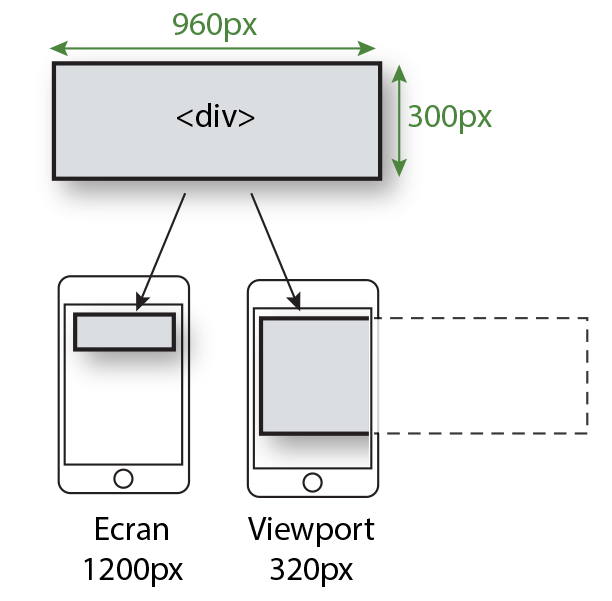
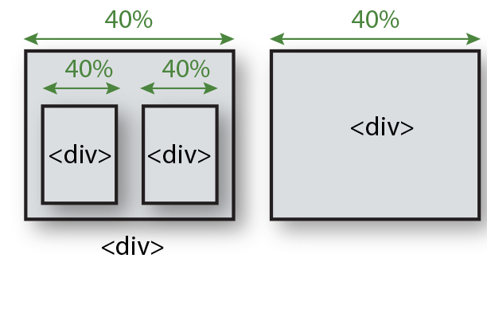
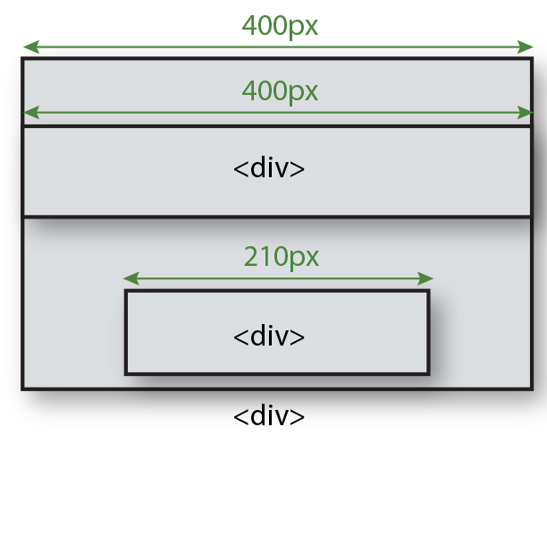

# Mesures

Lorsque l'on veut définir la taille d'un de nos éléments on a plusieurs choix concernant l'unité à utiliser. Vous avez certainement utilisé des `px` et vu des `em`, `rem`, `pt`,...Voyons ensemble à quoi correspond ces différentes unités et dans quels cas les utiliser.

- [Mesures](#mesures)
  - [px](#px)
  - [%](#)
  - [em](#em)
  - [rem](#rem)
  - [vw / vh](#vw--vh)
    - [vmin / vmax](#vmin--vmax)
  - [pt, pc](#pt-pc)
  - [mm / cm / in](#mm--cm--in)

## px

Unité de mesure en pixels. La taille des objets et des polices de caractères se réfère à la concentration de pixels de l'écran (résolution de l'écran).

On utilise les `pixels` généralement pour la largeur des bordures ou pour des éléments compris dans des designs à largeur fixe. Ils peuvent aussi servir pour le décalage des ombres en `box-shadow`.

On évite les `px` pour la typographie.

```css
div{
  width: 960px;
  min-height: 300px;
}
```



## %

Taille définie en fonction de la largeur du navigateur et ensuite des contenants parents.

On utilise les `%` sur des images ou conteneurs à taille variables/responsive.

On évite les `pourcentages` pour la typographie.

```css
div{
  width: 40%;
  margin: 5%;
  float: left;
}
```

```html
<div>
  <div></div>
  <div></div>
</div>
<div></div>
```



## em

Dimension relative proportionnelle à la taille de caractère (font-size) définie pour la balise `<body>` ou dans une balise parent direct.

On utilise les `em` pour la typographie et les éléments qui lui sont liés comme les marges ou les padding. Attention toute fois que les `em`peuvent être plus compliqués à employer sur des projets plus complexe, on leur préférera les `rem`.

```css
body{
  font-size: 200px;
}
div{
  width: 0.5em;
  font-size: 0.5em;
}
```

```html
<body>
  <div>
    <div>
      <div></div>
    </div>
  </div>
</body>
```


## rem

Dimension relative proportionnelle à la taille de caractère (font-size) définie dans la balise `<html>`ou dans le sélecteur `::root`. 

```css
html{ font-size:20px; }
div:first-child{ width:20rem; }
div:last-child{ width:10.5rem; }
```

```html
<body>
  <div>
    <div></div>
    <div></div>
  </div>
</body>
```



## vw / vh

Mesures relatives à la taille du viewport (fenêtre du navigateur). Une unité représente 1% de la dimension du contenant.

On utilise les `vw` et `vh`pour les conteneurs responsive.

```css
div{width:50vw;}
```

```html
<body>
  <div></div>
</body>
```


### vmin / vmax

Équivalent à la taille minimum ou maximum du viewport.

## pt, pc

Mesure dédiées à l'impression de caractères sur la base de 72dpi (1 inches = 72pt) pour le **p**oin**t** et sur 6dpi (1 inches = 6pc) pour le **p**i**c**as. 

On utilise les `points`et `picas`pour les feuilles de styles destinées à l'impression.

On évite ces unités pour tout autre utilisation.

```css
h1{font-size: 50pt}
```

```html
<h1>Texte</h1>
```


## mm / cm / in

Mesures dédiées à l'impression pour définir la taille d'un objet à l'impression.

On utilise les `mm`, `cm`et `in`pour les feuilles de styles destinées à l'impression.

On évite ces unités pour tout autre utilisation.

```css
img{width: 10cm;}
```

```html

```

